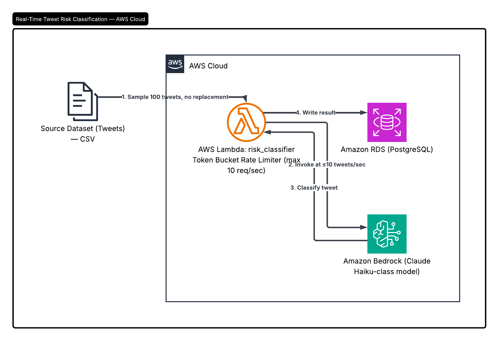

# Architecture Design: Tweet Behavioral Risk Analysis Pipeline

## 1. System Overview

This system simulates a real-time content risk classification pipeline. It ingests a randomly sampled batch of 100 tweets (without replacement) from a source dataset, throttles processing to a maximum of 10 tweets/sec to mimic real-time inference, classifies each tweet's suicide risk level using an LLM via Amazon Bedrock, and persists the results — including a derived binary alert flag — to a relational data store for downstream querying and review.

The pipeline is intentionally linear and stateless per-tweet: each tweet is sampled once, classified once, and written once. Rate limiting and classification are decoupled from sampling so each concern can be reasoned about and tested independently.

## 2. Architecture Diagram

**Flow description:**

1. A driver script samples 100 tweets at random, without replacement, from the source dataset before any inference begins.
2. The sampled tweets are fed into the pipeline through a Lambda function one at a time, governed by a token-bucket rate limiter capped at 10 requests/second.
3. For each tweet, the Lambda function invokes Amazon Bedrock with a fixed system prompt, passing the tweet text and receiving a structured classification.
4. The Lambda function parses the model's output, derives the `alert_of_risk` flag, and writes the row to a PostgreSQL table in RDS.
